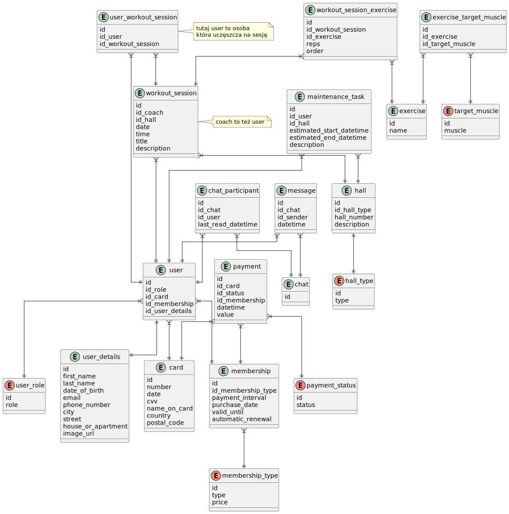

# gym-api

Gym app api


## Frontend

https://github.com/filip-stepien/gym-frontend

### Plan

- Authorization with [OAuth 2.0](https://datatracker.ietf.org/doc/html/rfc6749) and [keycloak](https://www.keycloak.org/).
- [Spring Boot](https://spring.io)

### Database Model



### Endpoints

Documetation can be acceseed at 

> [!NOTE]  
> Those paths do not include context path which is by default `/api`


- WEBui `/swagger`
- openAPI `/api-docs`


<details open>
<summary>Legacy endpoints plan</summary>
<br>


`GET` `/roles`

```json
{[
    {
        "id": "id-role-1",
        "role": "coach"
    },
    {
        "id": "id-role-2",
        "role": "client"
    },
    ...
]}
```

`GET` `/roles/:id`

```json
{
    "id": "id-role-1",
    "role": "coach"
}
```

`GET` `/users`

```json
{[
    {
        "id": "id-user-1",
        "role": "client",
        "card": {
            "number": "0000 0000 0000 0000",
            "valid_until": 1744034827,
            "cvv": "123",
            "name_on_card": "John Pork",
            "country": "Poland",
            "postal_code": "25-001"
        },
        "membership": {
            "type": "standard",
            "payment_days_interval": 30,
            "purchase_timestamp": 1744034827,
            "last_payment_timestamp": 1744034827,
            "valid_until": 1744034827,
            "automatic_renewal": true
        },
        "details": {
            "first_name": "John",
            "last_name": "Pork",
            "birth_date": {
                "year": 2002,
                "month": 2,
                "day": 21
            },
            "email": "example@example.com",
            "phone_number": "123123123",
            "city": "Kielce",
            "street": "Nowa",
            "house_number": "1b",
            "apartment_number": "2a",
            "image_url": "foo/ bar/image.png"
        }
    },
    {
        "id": "id-user-2",
        "role": "coach",
        "card": null,
        "membership": null,
        "details": {
            "first_name": "John",
            "last_name": "Pork",
            "birth_date": {
                "year": 2002,
                "month": 2,
                "day": 21
            },
            "email": "example@example.com",
            "phone_number": "123123123",
            "city": "Kielce",
            "street": "Nowa",
            "house_number": "1b",
            "apartment_number": "2a",
            "image_url": "foo/bar/image.png"
        }
    }
    ...
]}
```

`GET` `/users/:id`

```json
{
    "id": "id-user-2",
    "role": "coach",
    "card": null,
    "membership": null,
    "details": {
        "first_name": "John",
        "last_name": "Pork",
        "birth_date": {
            "year": 2002,
            "month": 2,
            "day": 21
        },
        "email": "example@example.com",
        "phone_number": "123123123",
        "city": "Kielce",
        "street": "Nowa",
        "house_number": "1b",
        "apartment_number": "2a",
        "image_url": "foo/bar/image.png"
    }
}
```

`DELETE` `/users/:id`

```
<body empty>
```

`PATCH` `/users/:id`

```json
{
    "details": {
        "email": "example@example.com",
        "phone_number": "123123123"
    }
}
```

```json
{
    "membership": {
        "type": "premium"
    }
}
```

```json
{
    "card": {
        "number": "0000 0000 0000 0000"
    }
}
```

`GET` `/halls`

```json
{[
    {
        "id": "id-hall-1",
        "type": "yoga",
        "number": "2a",
        "description": "Hall for yoga."
    },
    {
        "id": "id-hall-2",
        "type": "fbw",
        "number": "3a",
        "description": "Hall for FBW."
    },
    ...
]}
```

`GET` `/halls/:id`

```json
{
    "id": "id-hall-1",
    "type": "yoga",
    "number": "2a",
    "description": "Hall for yoga."
}
```

`POST` `/halls`

```json
{
    "type": "yoga",
    "number": "2a",
    "description": "Hall for yoga."
}
```

`PATCH` `/halls/:id`

```json
{
    "type": "yoga"
}
```

`DELETE` `/halls/:id`

```
<empty body>
```

`GET` `/maintenance-tasks`

```json
{[
    {
        "id": "id-maintenance-1",
        "hall": {
            "number": "2a"
        },
        "employee": {
            "details": {
                "first_name": "John",
                "last_name": "Pork",
                "image_url": "image.png"
            }
        },
        "start_timestamp": 1744034827,
        "end_timestamp": 1744034827,
        "description": "Annual maintenance."
    },
    {
        "id": "id-maintenance-2",
        "hall": {
            "number": "2a"
        },
        "employee": {
            "details": {
                "first_name": "Bob",
                "last_name": "Beef",
                "image_url": "image.png"
            }
        },
        "start_timestamp": 1744034827,
        "end_timestamp": 1744034827,
        "description": "Monthly maintenance."
    },
    ...
]}
```

`GET` `/maintenance-tasks/hall/:id`

```json
{[
    {
        "id": "id-maintenance-1",
        "employee": {
            "details": {
                "first_name": "John",
                "last_name": "Pork",
                "image_url": "image.png"
            }
        },
        "start_timestamp": 1744034827,
        "end_timestamp": 1744034827,
        "description": "Annual maintenance."
    },
    {
        "id": "id-maintenance-2",
        "employee": {
            "details": {
                "first_name": "Bob",
                "last_name": "Beef",
                "image_url": "image.png"
            }
        },
        "start_timestamp": 1744034827,
        "end_timestamp": 1744034827,
        "description": "Monthly maintenance."
    },
    ...
]}
```

`DELETE` `/maintenance-tasks/:id`

```json
<empty body>
```
</details>

## Contributing

### Development setup

Prerequisites:

-   docker-compose
-   https://direnv.net/ or you are on your own with tools.

### Coding

#### using task

`task dev`

#### Manually
- run `docker-compose -f src/docker/docker-compose.yaml up`
- ???
- commit

### Manually generating documetation

`task docs`


# FAQ

## Q: Why not `@Data`

https://youtu.be/Gd6AQsthXNY?t=2722
