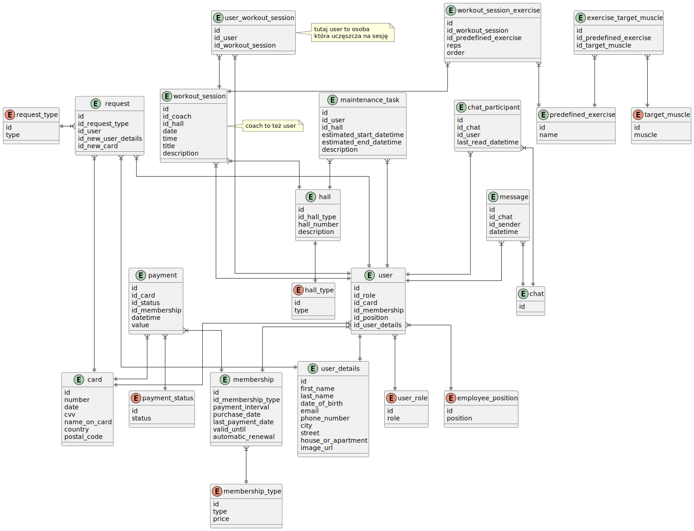

# gym-api

## Plan

- Możlowość autorzyacji użtkownika przy użyciu [OAuth 2.0](https://datatracker.ietf.org/doc/html/rfc6749) i [keycloack](https://www.keycloak.org/).
- [Spring Boot](https://spring.io)

## Schemat bazy danych

