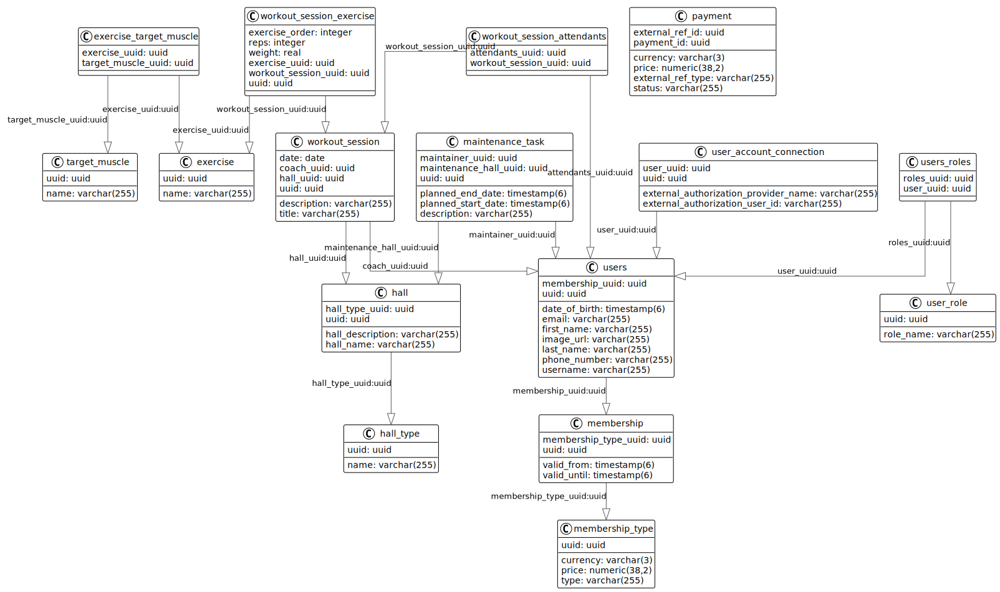

# gym-api

### Plan

-   Authorization with [OAuth 2.0](https://datatracker.ietf.org/doc/html/rfc6749) and [keycloack](https://www.keycloak.org/).
-   [Spring Boot](https://spring.io)

### Database Model

### Endpoints

...

## Contributing

### Development setup

Prerequisites:

-   docker-compose
-   https://direnv.net/ or you are on your own with tools.

### Manually generating documetation

`task docs`
